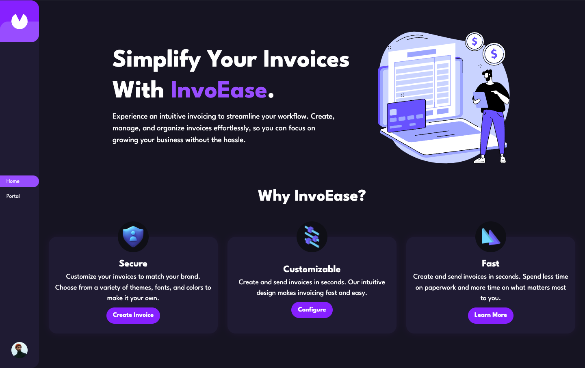
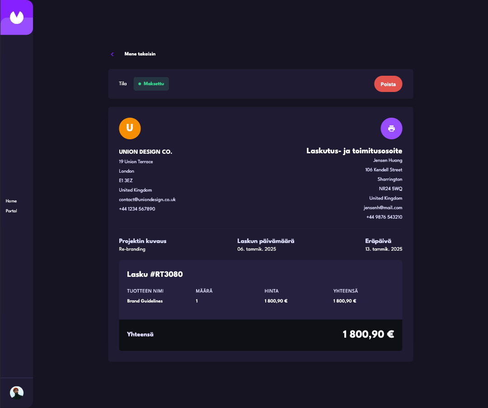

# InvoEase

InvoEase is a comprehensive invoicing application designed to streamline the process of creating, managing, and tracking invoices. The application provides a user-friendly interface for managing client and company information, generating invoices, and tracking payment statuses.

## Table of Contents

- [Features](#features)
- [Installation](#installation)
- [Usage](#usage)
- [Technologies Used](#technologies-used)
- [Project Structure](#project-structure)
- [Contributing](#contributing)
- [License](#license)

## Features

- **Invoice Management**: Create, edit, and delete invoices.
- **Client and Company Management**: Manage client and company information.
- **Status Tracking**: Track the status of invoices (Draft, Pending, Paid).
- **Responsive Design**: Fully responsive design for mobile and desktop.
- **Accessibility**: Improved accessibility features for better user experience.
- **Localization**: Support for multiple languages.

## Installation

To get started with InvoEase, follow these steps:

1. **Clone the repository**:
   ```bash
   git clone https://github.com/VictorKevz/InvoEase.git
   cd InvoEase
   ```

2. **Install dependencies**:
   ```bash
   npm install
   ```

3. **Run the application**:
   ```bash
   npm run dev
   ```

4. **Build the application**:
   ```bash
   npm run build
   ```

5. **Preview the build**:
   ```bash
   npm run preview
   ```

## Usage

1. **Navigate to the application**:
   Open your browser and go to `http://localhost:3000`.

2. **Create a new invoice**:
   Click on the "New Invoice" button and fill out the form to create a new invoice.

3. **Manage invoices**:
   View, edit, and delete invoices from the invoice list.

4. **Filter invoices**:
   Use the filter options to view invoices by status (Draft, Pending, Paid).

5. **Localization**:
   Change the language from the settings page.

## Technologies Used

- **React**: JavaScript library for building user interfaces.
- **Framer Motion**: Library for animations.
- **i18next**: Internationalization framework.
- **MUI**: Material-UI for React components.
- **Day.js**: Date manipulation library.
- **Lodash**: Utility library for JavaScript.
- **Vite**: Next-generation frontend tooling.

## Project Structure

```plaintext
src/
├── assets/                 # Images and other assets
├── components/             # React components
│   ├── Form/               # Form-related components
│   ├── InvoiceButton.jsx   # Invoice button component
│   ├── InvoiceCard.jsx     # Invoice card component
│   ├── StatusBar.jsx       # Status bar component
│   └── ...                 # Other components
├── hooks/                  # Custom hooks
├── pages/                  # Page components
│   ├── Home/               # Home page
│   ├── Portal/             # Portal page
│   ├── Settings/           # Settings page
│   ├── DetailedInvoice/    # Detailed invoice page
│   └── ...                 # Other pages
├── reducers/               # Redux reducers
│   ├── formReducer.js      # Form reducer
│   ├── invoiceReducer.js   # Invoice reducer
│   ├── settingsReducer.js  # Settings reducer
│   └── initialData/        # Initial data for reducers
├── utils/                  # Utility functions
├── variants/               # Animation variants
├── App.jsx                 # Main App component
├── index.jsx               # Entry point
└── i18n.js                 # i18next configuration
```

## Contributing

Contributions are welcome! If you would like to contribute to this project, please follow these steps:

1. **Fork the repository**.
2. **Create a new branch**:
   ```bash
   git checkout -b feature/your-feature-name
   ```
3. **Make your changes**.
4. **Commit your changes**:
   ```bash
   git commit -m 'Add some feature'
   ```
5. **Push to the branch**:
   ```bash
   git push origin feature/your-feature-name
   ```
6. **Open a pull request**.

## License

This project is licensed under the MIT License. See the LICENSE file for details.
```

### Summary
 **Installation**: Provides step-by-step instructions for setting up the project.
- **Usage**: Explains how to use the application.
- **Technologies Used**: Lists the main technologies used in the project.
- **Project Structure**: Provides an overview of the project's directory structure.
- **Contributing**: Explains how to contribute to the project.
- **License**: Specifies the project's license.

This README file provides a comprehensive overview of your project and should help users understand how to set up, use, and contribute to InvoEase.
### Summary

- **Features**: Lists the main features of the application.
- **Installation**: Provides step-by-step instructions for setting up the project.
- **Usage**: Explains how to use the application.
- **Technologies Used**: Lists the main technologies used in the project.
- **Project Structure**: Provides an overview of the project's directory structure.
- **Contributing**: Explains how to contribute to the project.
- **License**: Specifies the project's license.
